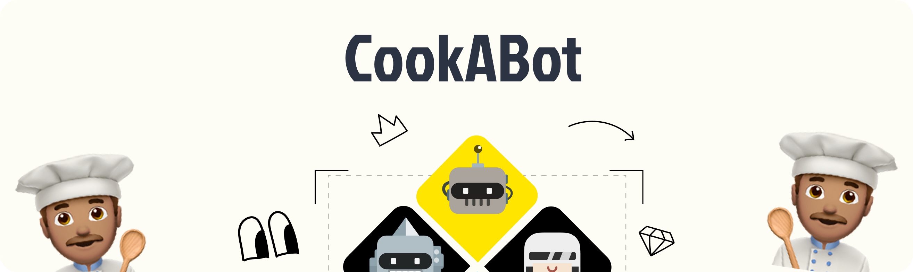
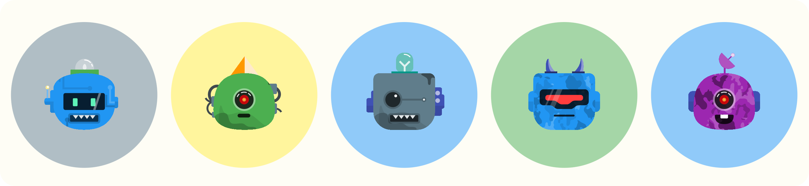

    

# CookABot 🤖🍳

Welcome to CookABot, where creativity meets avatars! 🎨 Design your very own bot avatars using the power of Flutter and Riverpod. Express yourself by customizing various bot features, or let randomness surprise you with a unique creation. Save and share your bots for an eye-catching online presence! 🚀

## Preview 🌐

https://github.com/SolomonAbuh/CookAbot/assets/67615397/e3b0e5ef-331a-4258-8a13-e60c31064e00

## Features 🌟

- **Customizable Avatars**: Mix and match top, ears/side, mouth, bot textures, and colors to craft the perfect bot avatar that resonates with your personality.

- **Random Generator**: Feeling adventurous? Hit the "Random" button and let CookABot whip up a surprise bot design just for you!

- **Image Downloads**: Once you've created your masterpiece, easily download your bot avatar as a stunning image that's ready to be shared across platforms.

## Tech Stack 🛠️

CookABot is powered by these awesome packages:

- [google_fonts](https://pub.dev/packages/google_fonts): Dynamically generate beautiful text styles.
- [flutter_svg](https://pub.dev/packages/flutter_svg): Render SVG images smoothly.
- [flutter_riverpod](https://pub.dev/packages/flutter_riverpod): Manage state like a pro with Riverpod 2.0.
- [sizer](https://pub.dev/packages/sizer): Create responsive layouts effortlessly.
- [screenshot](https://pub.dev/packages/screenshot): Capture your bot creations as images.

## Getting Started 🚀

1. Clone this repository.
2. Run `flutter pub get` to install dependencies.
3. Let the bot avatar creation begin with `flutter run`!

## Showcase 🤩

Here are some of the amazing bot characters generated from CookABot

    

## Resources 📜

This project wouldn't have been successful without the following resources

- [Bottt library](https://www.dropbox.com/s/x8ine5gsm5hubya/Bottts.sketch?dl=0) designed by [Pablo Stanley](https://twitter.com/pablostanley)

---

Let's connect! Share your awesome bots with us on [Twitter](https://twitter.com/Solomon_dart) using #CookABot. Have fun creating and happy bot cooking! 🍽️🤖
